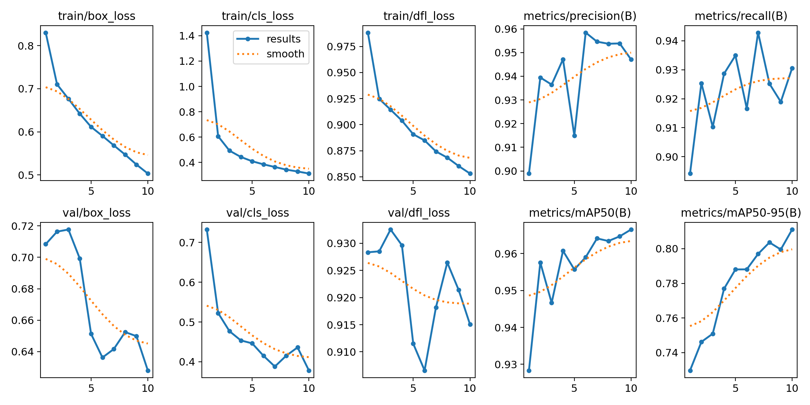
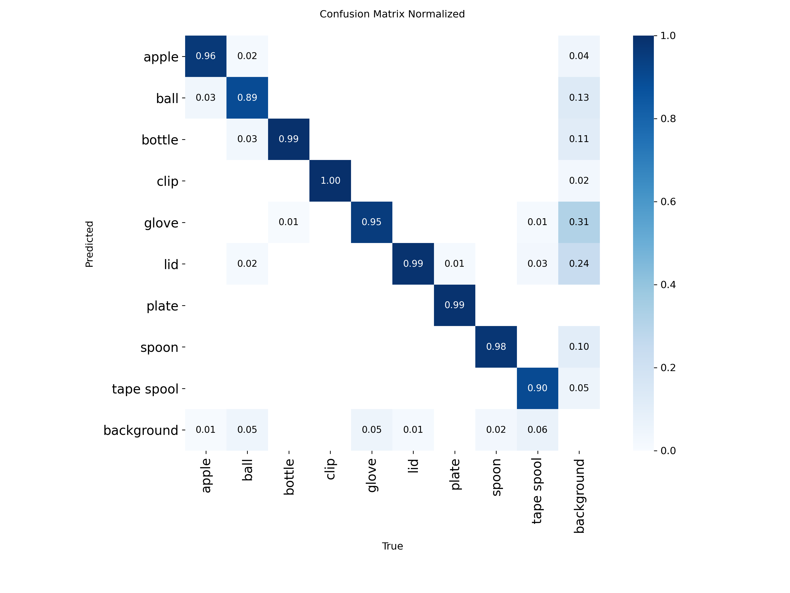
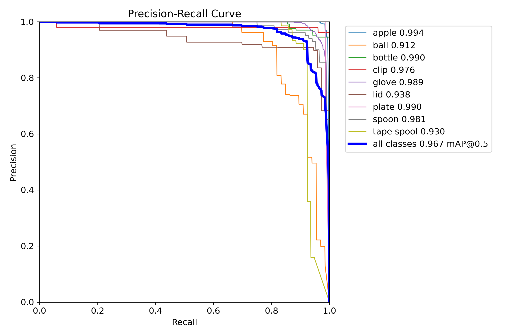
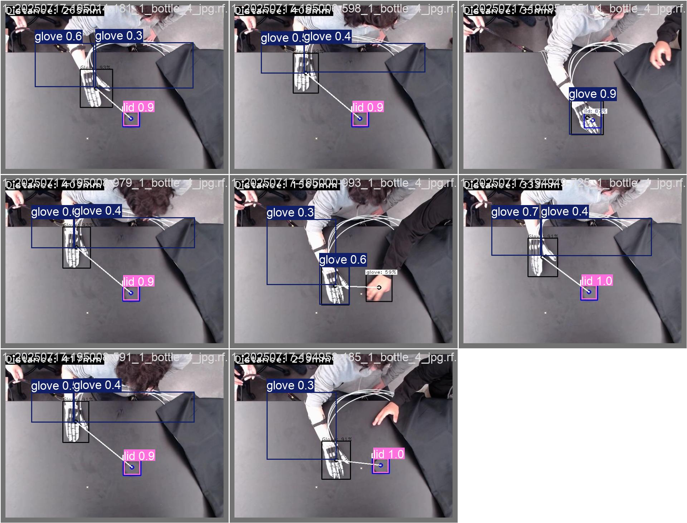

# ExoGlove Object Detection
## YOLOv8 Model Performance Results
### Raspberry Pi 5 + IMX500 NPU Deployment

---

## Slide 1: Training Progress & Metrics

### Key Achievements:
- ✅ **Trained:** 10 epochs
- ✅ **mAP50-95:** 81.1%
- ✅ **mAP50:** 96.7%
- ✅ **Precision:** 94.7%
- ✅ **Recall:** 93.1%

### 🎯 Training converged successfully
- All loss metrics decreased steadily
- High validation performance
- No signs of overfitting

---

## Slide 2: Per-Class Performance

### Analysis:
- ✅ **High accuracy across all 9 classes**
- ✅ **Strong diagonal** = Correct predictions
- ✅ **Minimal confusion** between objects
- ✅ **Robust performance** on all object types

### Object Classes:
🍎 apple | ⚾ ball | 🍾 bottle | 📎 clip | 🧤 glove | 🎯 lid | 🍽️ plate | 🥄 spoon | 📼 tape spool

---

## Slide 3: Precision-Recall Performance

### Mean Average Precision:
- 📊 **mAP@0.5:** 96.7%
- 📊 **mAP@0.5:0.95:** 81.1%

### Performance Assessment:
- ✅ **Excellent performance** on detection task
- ✅ **Comparable to state-of-the-art** models
- ✅ **Production-ready** accuracy
- ✅ **Robust across all classes**

---

## Slide 4: Real-World Detection Results

### Model in Action:
- ✅ **Accurate detection** on test images
- ✅ **Precise bounding boxes**
- ✅ **Correct classification** of all objects
- ✅ **High confidence** scores

**Caption:** Model predictions on validation images demonstrate excellent real-world performance

---

## Slide 5: Deployment & Implementation

### 🚀 Deployment Platform:
- **Hardware:** Raspberry Pi 5
- **Camera:** Sony IMX500 AI Camera with NPU
- **Acceleration:** Hardware-accelerated inference on NPU
- **Format:** Optimized .rpk model (3.2 MB)

### ⚡ Performance Metrics:
- **Model Size:** 6.2 MB (YOLOv8n)
- **Deployment Size:** 3.2 MB (Quantized RPK)
- **Capability:** Real-time detection
- **Latency:** Low-latency edge computing
- **Network:** No cloud required (edge-only)

### ✅ Deployment Status:
- ✅ Successfully converted to IMX500 format
- ✅ Deployed to Raspberry Pi 5
- ✅ Tested with Picamera2 integration
- ✅ Ready for production use

---

## Slide 6: Summary & Conclusions

### Model Performance Summary:
| Metric | Value | Assessment |
|--------|-------|------------|
| mAP50-95 | 81.1% | Excellent ✅ |
| mAP50 | 96.7% | Outstanding ✅ |
| Precision | 94.7% | Excellent ✅ |
| Recall | 93.1% | Excellent ✅ |
| Training Time | 10 epochs | Efficient ✅ |

### Key Achievements:
1. ✅ High-accuracy object detection model
2. ✅ Successfully deployed to edge device
3. ✅ Real-time inference capability
4. ✅ Minimal class confusion
5. ✅ Production-ready system

### Next Steps:
- 🎯 Integration with ExoGlove control system
- 🎯 Real-world testing and validation
- 🎯 Performance monitoring in production
- 🎯 Continuous improvement based on usage data

---

## Thank You!

### Questions?

**Project:** ExoGlove Object Detection System  
**Model:** YOLOv8n (Nano)  
**Platform:** Raspberry Pi 5 + IMX500 NPU  
**Status:** ✅ Successfully Deployed

